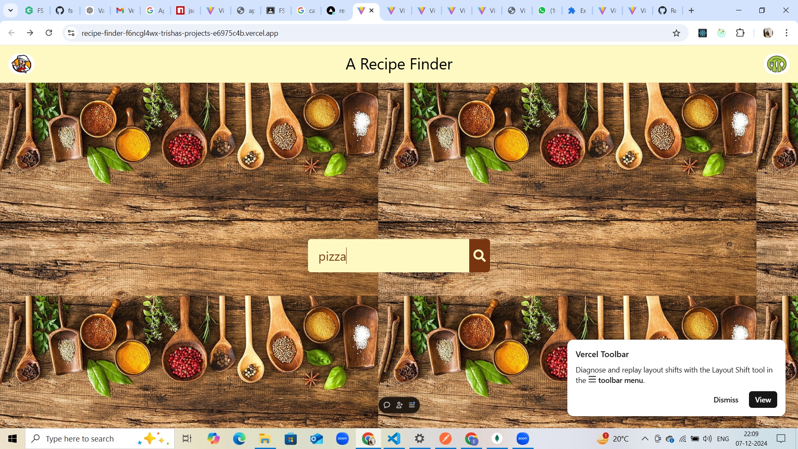
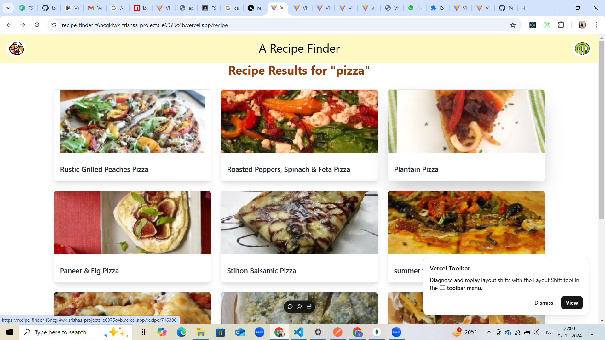
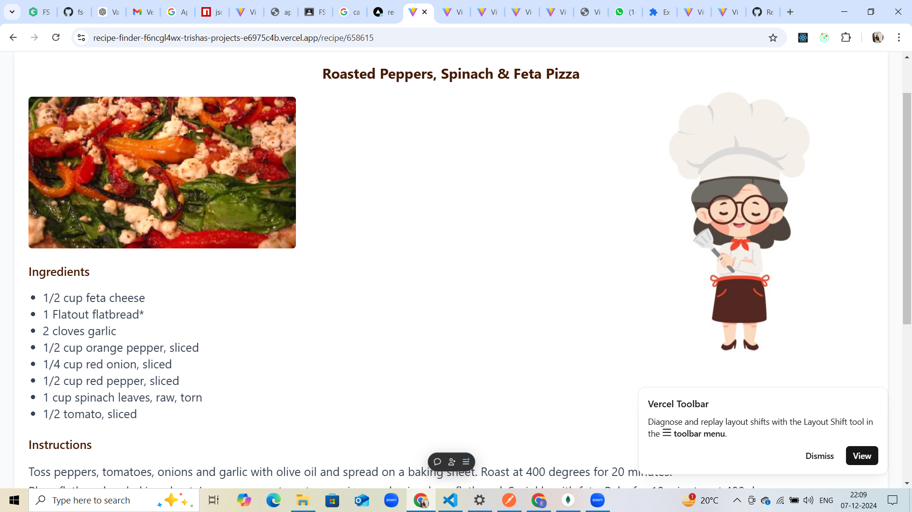

# Recipe Finder 
A sleek and user-friendly recipe search application built with React, enabling users to discover and explore recipes effortlessly.

## 🚀 Live Demo
Check out the live project: [Warehouse Management System](https://recipe-finder-f6ncgl4wx-trishas-projects-e6975c4b.vercel.app)

## 📂 Repository
Explore the code: [GitHub Repository](https://github.com/Trisha-Shukla/React-Projects/tree/main/recipe-finder)

## 📋 Table of Contents
- Introduction
- Features
- Installation
- Usage
- Technologies Used
- Configuration
- Examples

## 📖 Introduction
The Recipe Finder is a web-based application designed to help users find recipes by searching for ingredients, cuisines, or dish names. It fetches real-time data using external APIs and provides detailed recipe information, including ingredients, preparation steps, and more.

This project is part of the React Projects collection, demonstrating the implementation of modern React features such as hooks, context, and API integration.

## ✨ Features
Search for recipes by keyword or ingredient.
View detailed recipe information including:
Ingredients.
Preparation steps.
Nutrition details (if available).
Responsive design for seamless use across devices.

## 🛠️ Installation
To run the project locally, follow these steps:

Clone the repository:
git clone https://github.com/Trisha-Shukla/React-Projects.git
Navigate to the project directory:
cd recipe-finder
Install dependencies:
npm install
Start the development server:
npm start

## 🎮 Usage
Open the application in your browser:
http://localhost:3000
Search Recipes: Enter a keyword in the search bar to find recipes.
View Details: Click on a recipe to view detailed instructions and ingredients.
Responsive Design: The app is mobile-friendly and works on all screen sizes.

## 🛠️ Technologies Used
HTML: Markup structure.
CSS: Styling and responsive design.
React: Front-end library for building the UI.
Redux: State management for seamless data handling.
⚙️ Configuration
Customize settings or add environment variables in a .env file if required.

.

## 📸 Examples
Here’s what the application looks like:

### Search Dashboard

### Listing Management

### Details

