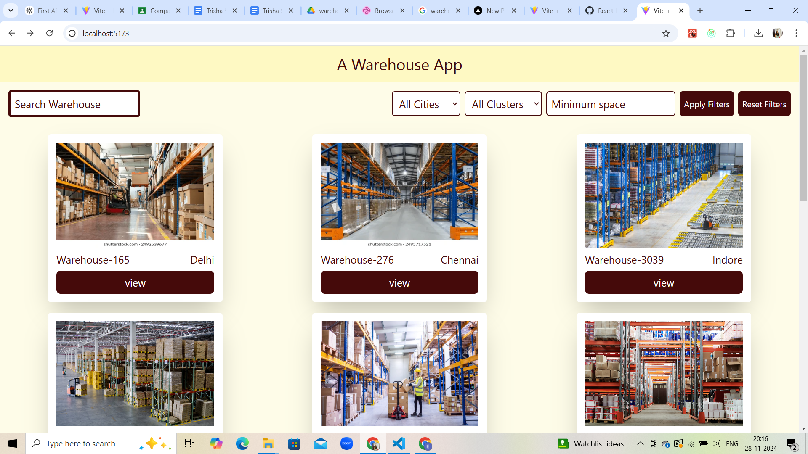
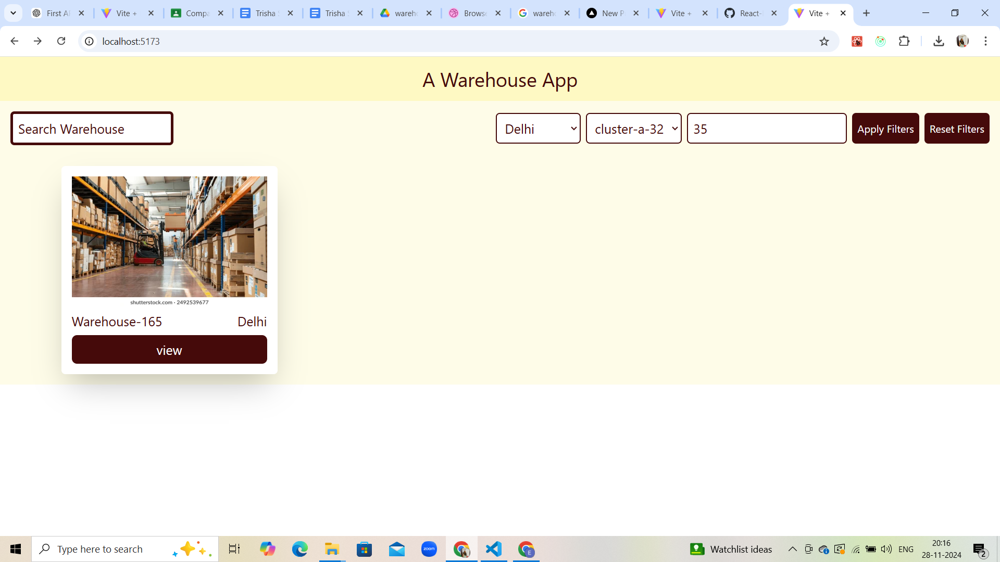
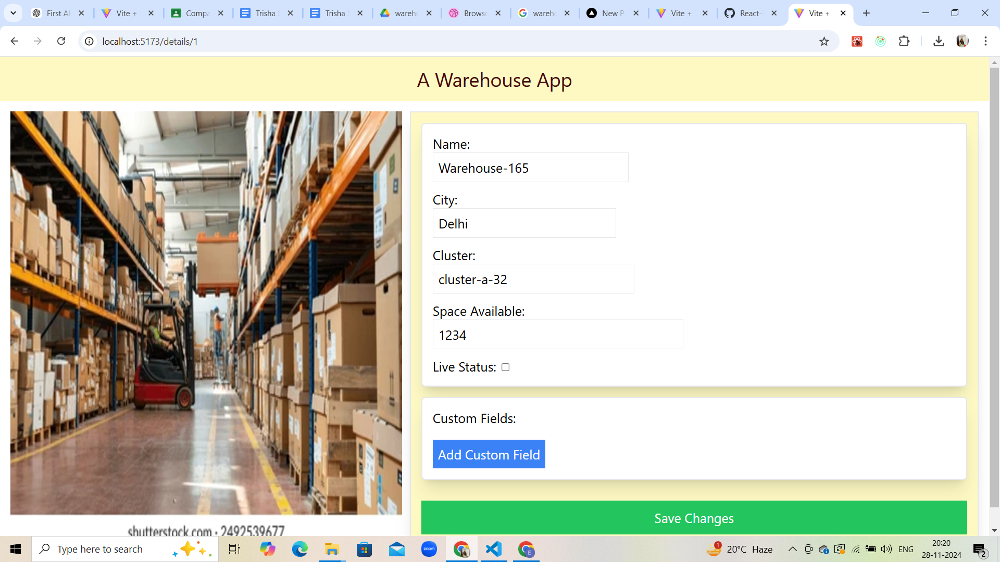

# Warehouse Management System
A Warehouse Management System built using HTML, CSS, React, and Redux to streamline inventory and logistics operations. This project is designed to help users efficiently manage their warehouse data with a responsive and interactive user interface.

## 🚀 Live Demo
Check out the live project: [Warehouse Management System](https://warehouse-project-ts.vercel.app/)

## 📂 Repository
Explore the code: [GitHub Repository](https://github.com/Trisha-Shukla/React-Projects/tree/main/warehouse-project)

## 📋 Table of Contents
- Introduction
- Features
- Installation
- Usage
- Technologies Used
- Configuration
- Examples

## 📖 Introduction
This project provides a robust interface for warehouse inventory management. It allows users to add, edit, delete, and track inventory details while leveraging modern front-end technologies for optimal performance and user experience.

## ✨ Features
Dynamic Inventory Management: Add, update, and remove items seamlessly.
Redux State Management: Efficient data handling and state updates.
Responsive Design: Optimized for both desktop and mobile devices.
Interactive UI: Smooth transitions and user-friendly interfaces.
Search and Filter Options: Quickly find specific items in your inventory.
🛠️ Installation
To run the project locally, follow these steps:

Clone the repository:
git clone https://github.com/Trisha-Shukla/React-Projects.git
Navigate to the project directory:
cd warehouse-project
Install dependencies:
npm install
Start the development server:
npm start

## 🎮 Usage
Open the application in your browser:
http://localhost:3000
Use the intuitive UI to:
Add new inventory items.
Edit details of existing items.
Delete items no longer needed.
View the inventory in an organized table with search and filter capabilities.

## 🛠️ Technologies Used
HTML: Markup structure.
CSS: Styling and responsive design.
React: Front-end library for building the UI.
Redux: State management for seamless data handling.
⚙️ Configuration
Customize settings or add environment variables in a .env file if required.

.

## 📸 Examples
Here’s what the application looks like:

### Inventory Dashboard

### Item Management

### Details

